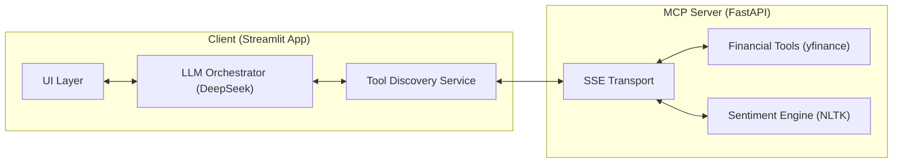
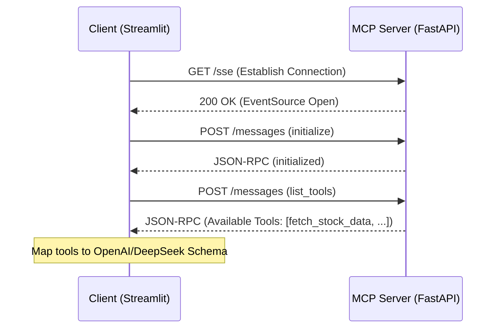
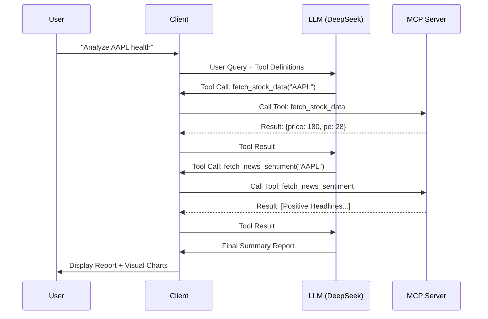

# Technical Architecture: Earnings Analyzer

This document details the internal design and technical decisions of the **Earnings Analyzer** project.

## 1. High-Level Architecture

The system is designed as a decoupled, microservice-oriented application leveraging the **Model Context Protocol (MCP)**. This allows for a clean separation between the user interface (client) and the specialized tools (server).

## 2. Communication Protocol (SSE)

We use **Server-Sent Events (SSE)** as the primary transport for MCP communication.

-   **Transport Logic**:
    -   **Client -> Server**: JSON-RPC 2.0 messages sent via HTTP POST to `/messages`.
    -   **Server -> Client**: Async message stream delivered via HTTP GET from `/sse`.
-   **Why SSE?**: It provides a lighter-weight alternative to WebSockets while maintaining a persistent connection, which is ideal for long-running financial data fetches and LLM interactions.

## 3. Data Flow & Sequence Diagrams

### 3.1 Startup & Discovery
When the client starts, it must discover what tools are available on the backend to provide them as "function declarations" to the LLM.

### 3.2 Chat & Tool Execution Loop
The core interaction loop follows a two-phase approach to ensure data completeness before final summarization.

## 4. Component Details

### 4.1 Orchestrator (DeepSeek v4-flash)
The LLM acts as the "Controller". It doesn't just generate text; it dynamically decides which tools to invoke based on the user's intent. The transition to `deepseek-v4-flash` via an OpenAI-compatible interface allows for high reasoning performance at lower latency.

### 4.2 Resource Mapping (`map_mcp_to_openai`)
This is a critical transformation layer. It converts the MCP `inputSchema` (JSON Schema) into the OpenAI `parameters` format. This allows the system to remain agnostic—any new tool added to the backend is automatically understood by the frontend.

### 4.3 UI Rendering Logic
The Streamlit frontend uses a "Stable Visual Container" pattern. During the data gathering phase, charts and cards are rendered immediately into this container, providing the user with instant feedback while the LLM continues its reasoning loop in the background.

## 5. Security & Error Handling

-   **API Security**: DeepSeek API keys are managed via environment variables (`DEEPSEEK_API_KEY`) or prompted securely in the UI.
-   **Graceful Degradation**:
    -   If the MCP server is unreachable, the client displays a connection error but allows the user to continue in "basic chat" mode.
    -   Tool execution errors are caught and fed back to the LLM, allowing it to explain the failure to the user or try an alternative approach.
-   **Rate Limiting**: `yfinance` calls are synchronous but wrapped in the async MCP framework to prevent blocking the main event loop.

## 6. Future Considerations

-   **Vector Database (RAG)**: The `.gitignore` and folder structure already account for a `/data/vector_db` directory, intended for future integration of PDF earnings call transcripts.
-   **Multi-Server Support**: The architecture supports connecting to multiple MCP servers (e.g., one for financial data, one for custom internal DBs) simultaneously.

---
*Created by Antigravity AI Assistant.*
