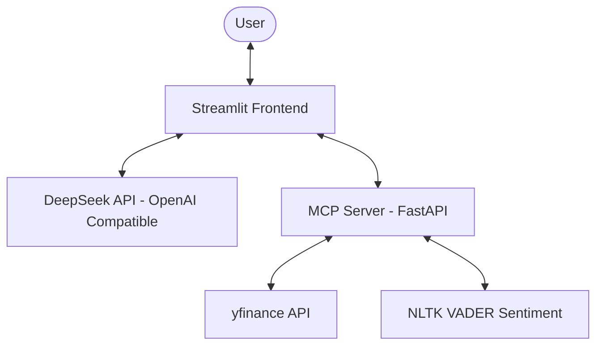

# Earnings Analyzer: Project Documentation

This document provides a comprehensive technical overview of the **Earnings Analyzer** project. It is designed to serve as a complete context for developers or AI models to understand the system architecture, code-level implementation, and how to extend its functionality.

---

## 1. Project Overview

**Earnings Analyzer** is a context-aware AI chat application that combines the reasoning capabilities of the **DeepSeek v4-flash** LLM with real-time financial data retrieval. It uses the **Model Context Protocol (MCP)** to decouple tool implementation (backend) from the AI orchestration (frontend).

### Core Objectives:
- Provide an interactive chat interface for financial queries.
- Fetch live stock data (price, P/E ratios, financials, news) dynamically.
- Provide rich visual feedback including charts and sentiment cards.
- Demonstrate a scalable microservice architecture using MCP over SSE (Server-Sent Events).

---

## 2. System Architecture

The project follows a **Client-Server Microservice** pattern:

### Components:
1.  **Client (Streamlit)**: Acts as the "Orchestrator". It manages the user session, interacts with DeepSeek, discovers tools from the MCP server, and executes tool calls. It also handles rich UI rendering.
2.  **MCP Server (FastAPI)**: Acts as the "Tool Provider". It encapsulates financial logic and exposes it via a standardized MCP interface.
3.  **LLM (DeepSeek v4-flash)**: The "Brain". It processes user intent and decides which tools to call based on the provided schemas.

---

## 3. Component Deep Dive

### 3.1 `mcp_server` (Backend)

Located in `/mcp_server`, this service exposes financial data tools.

-   **`main.py`**:
    -   Uses `FastMCP` to define tools.
    -   Mounts an SSE application on a FastAPI instance.
    -   **Endpoint**: `/sse` (for connection) and `/messages` (for communication).

-   **`tools/financial.py`**:
    -   **`get_stock_data`**: Basic price and valuation info.
    -   **`get_historical_prices`**: Historical OHLC data for charting.
    -   **`get_company_info`**: Sector, industry, and business summary.
    -   **`get_earnings_calendar`**: Upcoming earnings dates.
    -   **`get_financial_statements`**: Income statements or balance sheets (truncated to last 2 years).
    -   **`get_news_sentiment`**: Fetches news headlines and performs VADER sentiment analysis.

### 3.2 `client` (Frontend)

Located in `/client`, this Streamlit app manages the LLM loop and UI.

-   **`app.py`**:
    -   **Tool Discovery**: On startup, it connects to the MCP server and lists available tools.
    -   **Schema Mapping (`map_mcp_to_openai`)**: Converts MCP tool definitions into the OpenAI/DeepSeek function calling format.
    -   **Chat Loop (`process_chat`)**:
        -   **Phase 1: Data Gathering**: An iterative loop where DeepSeek calls tools. The client executes these on the MCP server and returns results. Rich visuals (charts, sentiment cards) are rendered *during* this phase in a stable container.
        -   **Phase 2: Summary Report**: Once all data is gathered, DeepSeek generates a final, comprehensive markdown report.
    -   **Rich Rendering**:
        -   `display_sentiment_card`: Renders color-coded cards for news sentiment.
        -   `display_price_chart`: Uses `st.line_chart` for historical price trends.
        -   `st.dataframe`: Displays financial statements in interactive tables.

---

## 4. Communication Protocol (MCP over SSE)

The project uses the **Server-Sent Events (SSE)** transport layer for MCP communication.

1.  **Connection**: The client opens a persistent GET request to `http://localhost:8000/sse`.
2.  **Messages**: The client sends JSON-RPC 2.0 messages to `http://localhost:8000/messages` (as POST requests).
3.  **Discovery**: The `list_tools` method allows the client to dynamically adapt to any new tools added to the server.

---

## 5. Rich UI Features

### Sidebar Integration
-   **Company Info**: Automatically updates with sector, industry, and business summary when `fetch_company_info` is called.
-   **Tool Discovery**: Displays a live list of tools available on the connected MCP server.

### Interactive Components
-   **Status Blocks**: Shows the step-by-step progress of tool execution and data analysis.
-   **Expandable Reports**: Summary reports and tool results are neatly tucked into expanders to keep the chat clean.

---

## 6. Future Expansion Ideas

### A. Advanced Analysis
-   **Technical Indicators**: Add tools for RSI, MACD, or Moving Averages.
-   **Peer Comparison**: A tool to fetch data for multiple tickers and compare them.

### B. RAG Integration
-   **Transcript Analysis**: Upload earnings call transcripts and use a vector database (FAISS) for semantic search.

### C. Enhanced Visualization
-   **Candlestick Charts**: Use Plotly for more advanced financial charting.
-   **Sentiment Over Time**: A chart showing how news sentiment has evolved.

---

## 7. Setup Summary

### Environment Variables:
- `DEEPSEEK_API_KEY`: Required for the client.
- `MCP_SERVER_URL`: Optional, defaults to `http://localhost:8000/sse`.

### Dependencies:
- **Server**: `fastapi`, `uvicorn`, `yfinance`, `mcp`, `nltk`, `pandas`.
- **Client**: `streamlit`, `mcp`, `openai`, `pandas`, `python-dotenv`.

---
*Generated by Antigravity AI Assistant.*
